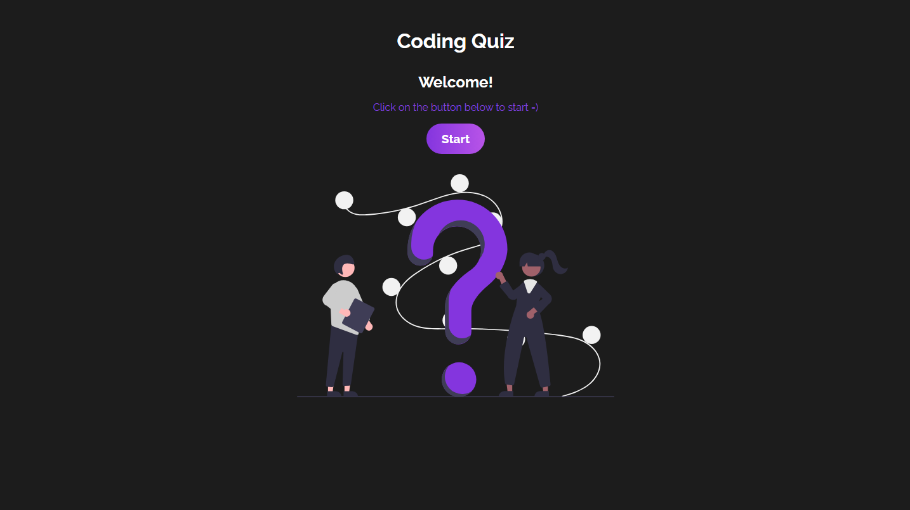
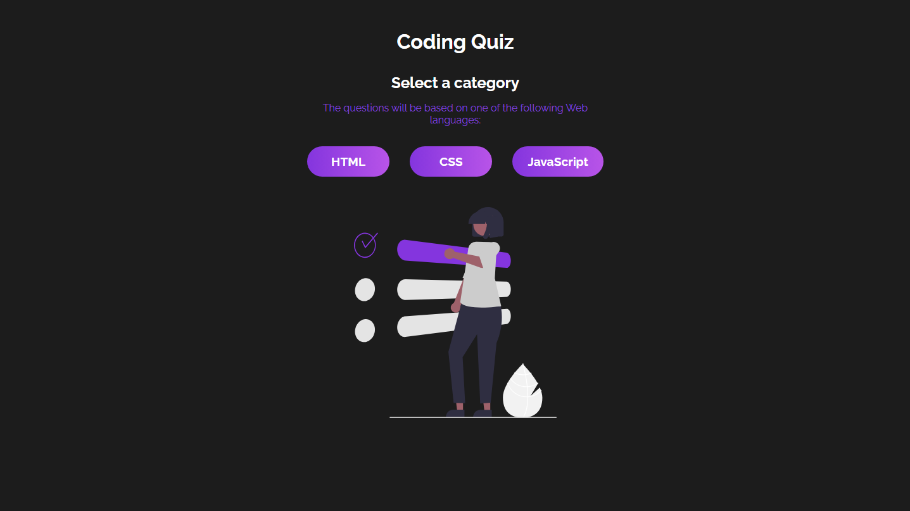
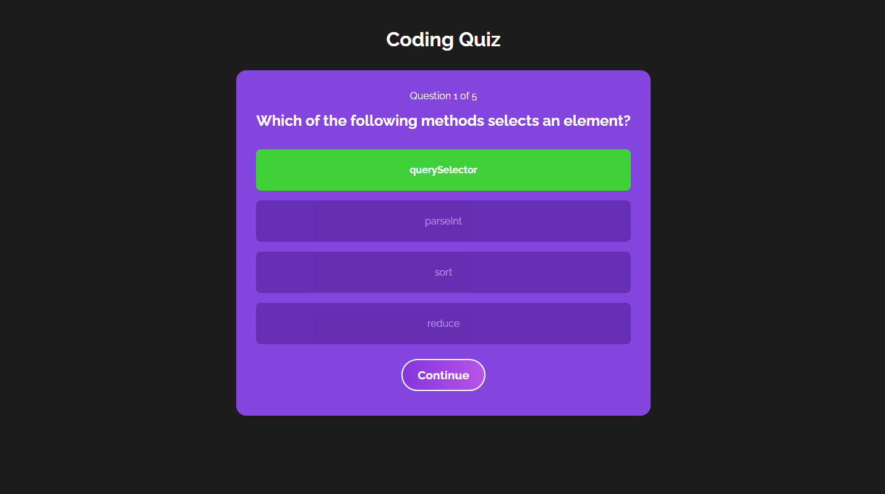
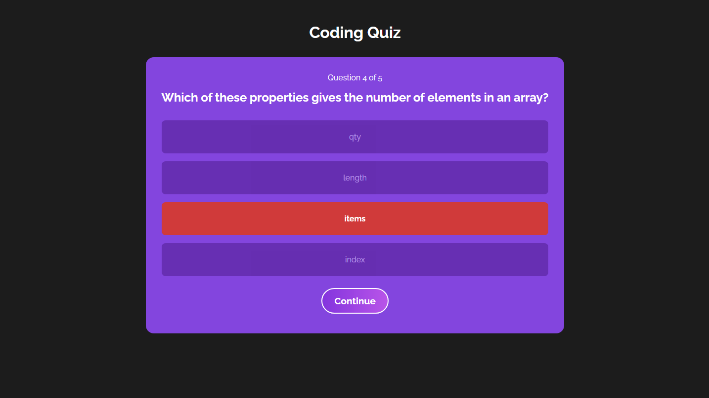
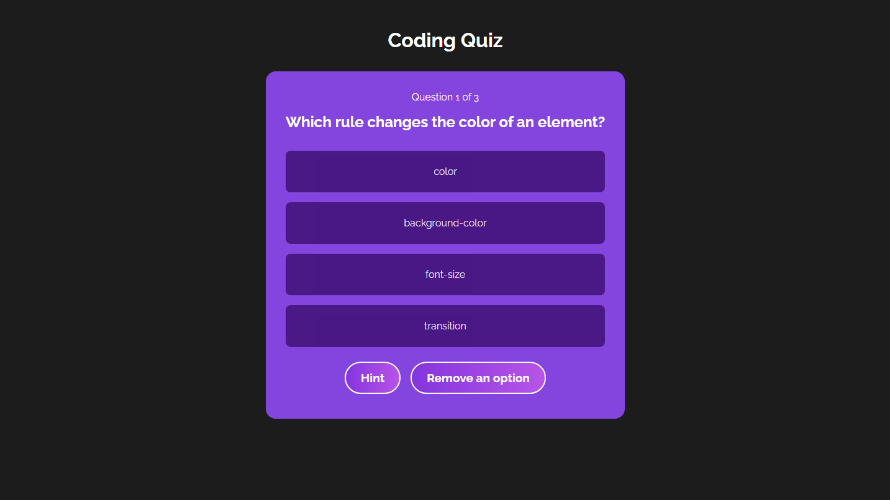
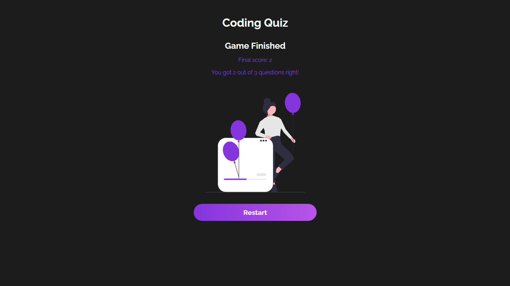

# Conding Quiz

A web development quiz in React. The user can select a category of questions, related to one of the three main web programming languages: HTML, CSS and JavaScript. Some questions have hints, but in all of them, a button can be pressed to remove an incorrect option and provide a clue.

Built with React and Vite, the project uses a [`quiz context`](https://github.com/mat-afk/coding-quiz/blob/main/src/context/quiz.jsx), as well as a reducer, to manage the state of the application, such as its stages, the user's score and the various actions that can be triggered by it in the different components.


## Getting Started

1. Clone this repository and enter it
   ```sh
   git clone https://github.com/mat-afk/coding-quiz.git
   cd coding-quiz
   ```
2. Install dependencies

   ```sh
   npm install
   ```

3. Run the app

   ```sh
   npm run dev
   ```

4. Open the indicated port to view it in the browser.
   

5. Pick a category.
   

6. Enjoy the quiz!
   
   
   
   
